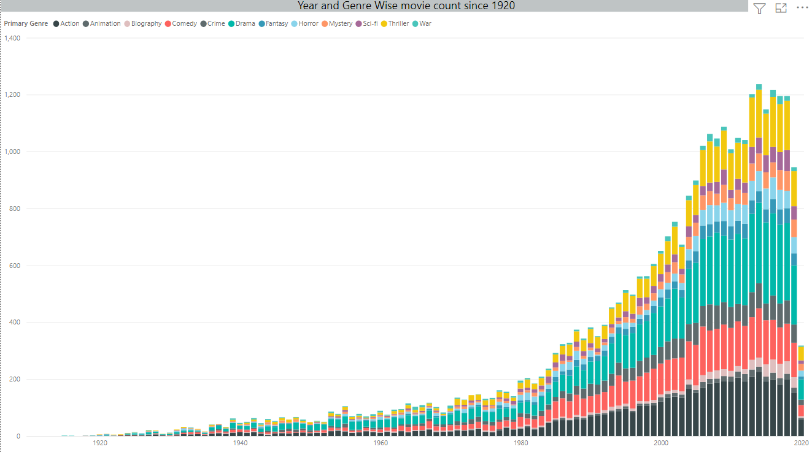
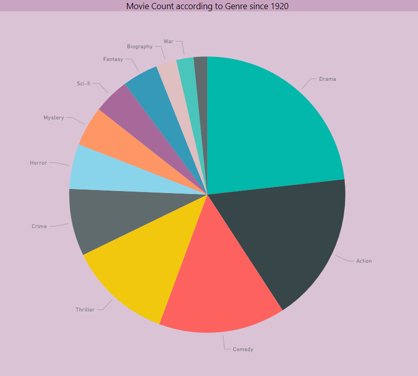
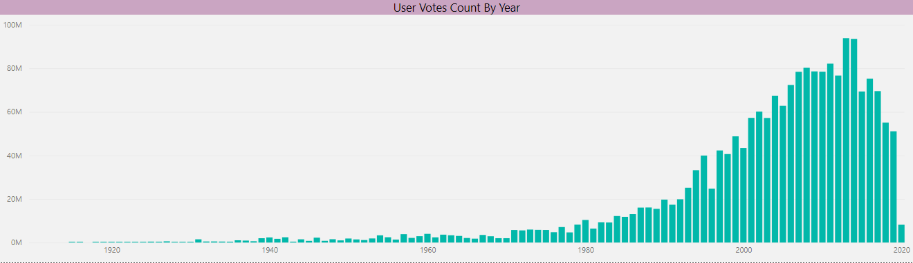

# IMDB Data Science Project-R
Data Science project based on IMDB Data for Data Analysis and Prediction(Movie Score) using R. 

A personal project made for practising and learning Data Analysis and Data Science Techniques in R. 

### Requirements to run and test the project:

To run this project, you will need RStudio, R  installed on the system. 

The reference links are provided below.

> **RStudio:**
  https://www.rstudio.com/products/rstudio/download/

> **R 3.0.1 or higher:**
  http://cran.r-project.org/
	
The necessary libraries and packages are specified in the **requirements.txt** file and will be validated in the below steps

## Process for acquiring the results: 

  * **Step 1:**
  RStudio has to be used for pulling the GitHub project:
  File > New Project > Version Control > Git. In the “repository URL” paste the URL of your new GitHub repository.
  (Make sure that you are in the newly created directory first!):
  
  	```git clone https://github.com/AjayTomar3342/IMDB_Data_Science_Project_R```

  * **Step 2:**
  Click “Create Project” to create a new sub-directory, which will be all of these things:

    a directory on your computer
    a Git repository, linked to a remote GitHub repository
    an RStudio Project

  
  **NOTE:** 
Since, the libraries used in the project are updated by the original developers regularly, some function/functions may not run as expected. This project will be regularly updated as per the updated libraries requirement, but if project does not run at any give time when you pull the project, it may be due to the library change, rather than a coding issue. This repository code is last updated to customize the libraries last on 06/07/2021. 

## Procedure followed in the Project:

   * **Step 1:**
   Data Scraping from IMDB done by Python Beautiful Soup. This gives a Pre-cleaned-file.csv which is used      further by R. Then Data Cleaning is done using R's tidyr. This gives R-Cleaned-File.csv. 
   
   * **Step 2:**
   Data Cleaning is then followed by Data Analysis which uses dplyr for Analysis and ggplot2 for 	      	 Visualization. As a result, Label-Encoded-data.csv file is created which is used for final step: 	      regression. 
  
   * **Step 3:**
   Finally, regression of various types such as Multiple Linear Regression, K-Nearest Neighbor and Random      Forest Regression are subjected on the clean data to create a suitable Regression Model for movie rating    score of IMDB movies. 
   

  **NOTE:** 
All csv files mentioned in the above steps are present in the Data_Files folder. Power BI file is present in the Root Folder. 

## Results:

Results are present in two forms: Analysis Results(Graphical) and Regression Results(Numerical). 

### Analysis Results: 

Cleaned Data is analyzed on the following parameters: 

1. Movie title proportion as per Starting Character.
2. Decade Wise Movie Count.
3. Most successful Primary Actor with at least 30 movies. 
4. Most successful Supporting Actor with at least 15 movies.
5. Most successful Directors with at least 20 movies.
6. Most successful Secondary Supporting Actor with at least 10 movies.
7. Movie proportion according to different genres.
8. User votes by consecutive years in the last century.
9. Average runtime of movies year wise in the last century.
10. Year Wise count of movies. 
11. Genre Popularity over the last century.

All these analysis are done using both Python and Power BI. Some of the visuals are shown below: 

 
 
 

Above visuals are taken from Power BI Visualization tool which provides a bit better clarity when compared to R's ggplot2 library.

### Regression Results:

Metric Scores for Models | Multiple Linear Regression | Lasso Regression | K-Nearest Neighbor | Random Forest Regression
---                      | --- | --- | --- | ---
R2 Score                 | 44.7 | 45.3 | 43.4 | 69.6
Mean Squared Error	 | 60 | 59.3 | 61.4 | 32.9
Model Score 		 | 44.2 | 44.7 | 52.7 | 95.7

These scores are calculated on the basis of usage of Python's scikit-learn library. 

To explain the Metrics and their relevance here, the metrics are explained below:

a.) R2 Score/Coefficient of Determination:  Means the % of variation of dependent variable which can be explained by independent variable. More the merrier. 

b.) Mean Squared Error(MSE): MSE measures the average of error squares i.e the average squared difference between the estimated values and true value. Less the better. 

c.) Model Score: Comparing the model predicted values to the actual values which we got by test data. More the number of matching values, the better

  **NOTE:** 
Please note that these figures and visuals have been taken on 27/8/2021. These may differ from the ones you get once you run this project again as data is scraped again and the whole procedure provides similar yet different results.  


